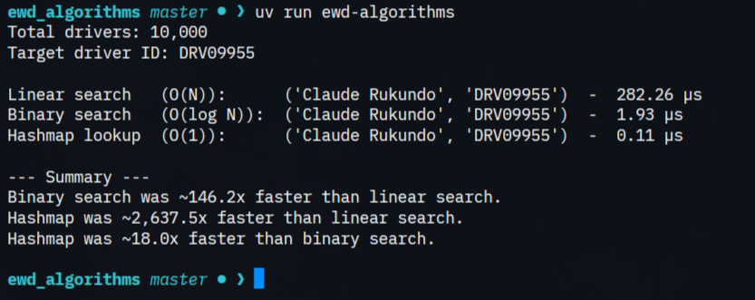

# ewd-algorithms

An experiment comparing three ways to find one driver in a list of 10,000.

We built a dataset of 10,000 drivers, each with an ID like `DRV04217` and a name. Then we looked up a random driver three different ways:

1. Linear search: goes through the dictionary item by item until it finds the ID.
2. Binary search: only works on sorted data, repeatedly splitting a sorted list in half.
3. Hashmap lookup: finds the value directly but pointing at the exact key of the target needed.

The goal is to see the difference in speed between O(N), O(log N), and O(1).

## Running it

```bash
uv run ewd-algorithms
```

> the program generates a random driver ID, runs all three searches on it 1,000 times each, and prints the average time per lookup in microseconds.




## Files

- `src/ewd_algorithms/drivers.py` holds the sample data
- `src/ewd_algorithms/main.py` has the searches and the timing code
